# Payroll Run Module

A full-stack payroll processing module that replaces an Excel-based HR payroll workflow.
Built with ASP.NET Core Web API, Dapper, SQL Server, and React.

---

## App Design

### Database Design

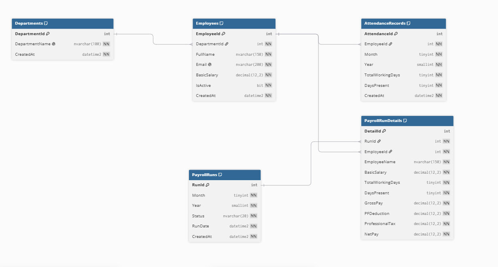

---

### API Documentation

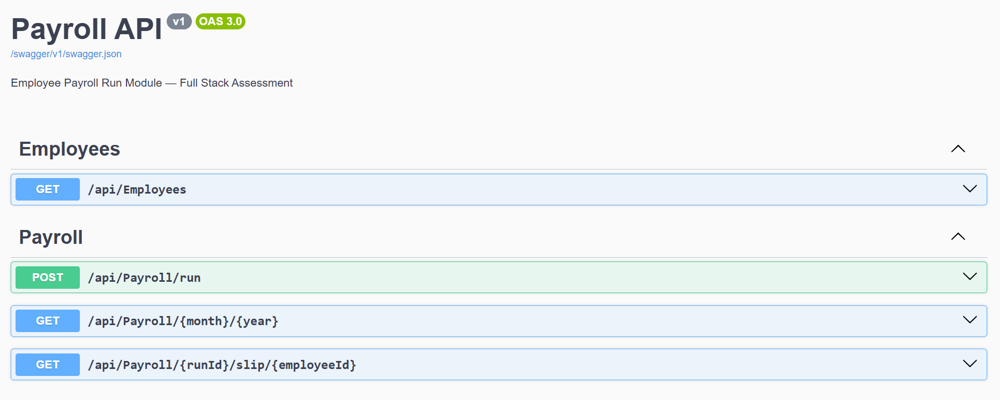

#### Employee API

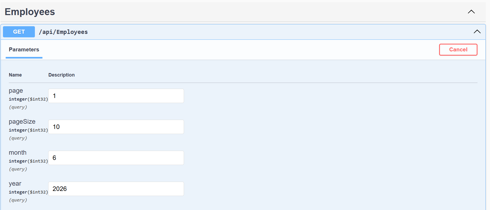
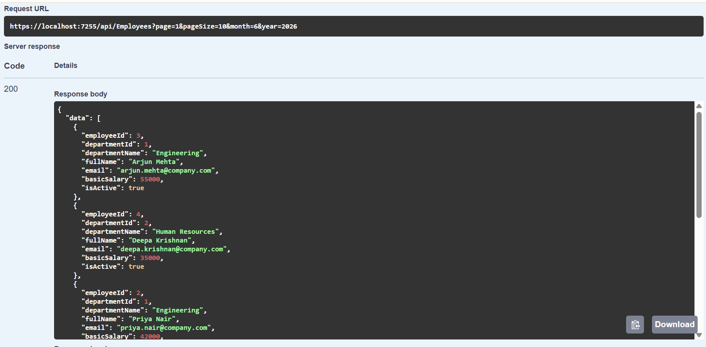

#### Payroll Run API

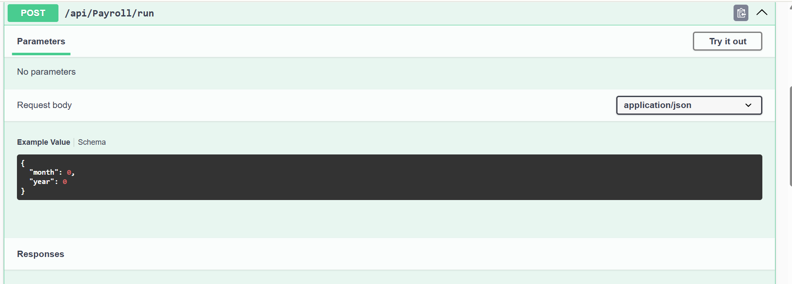
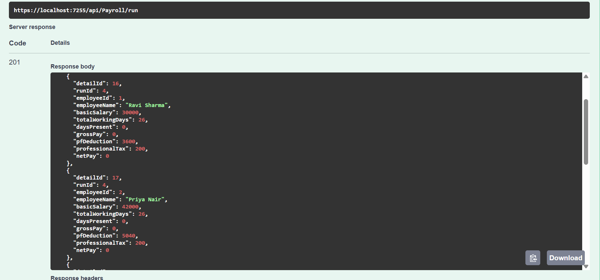

#### Payroll Details API — GET

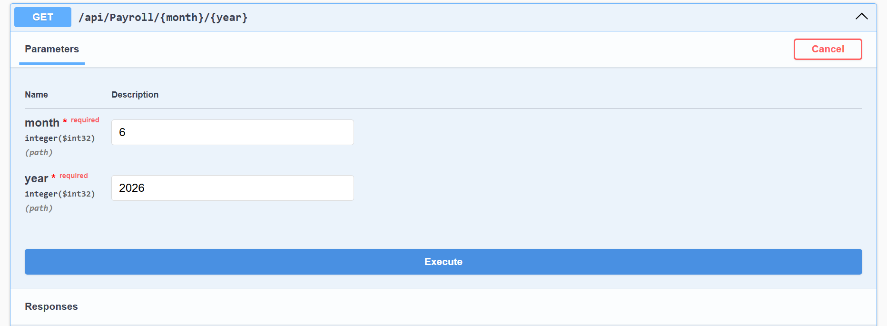
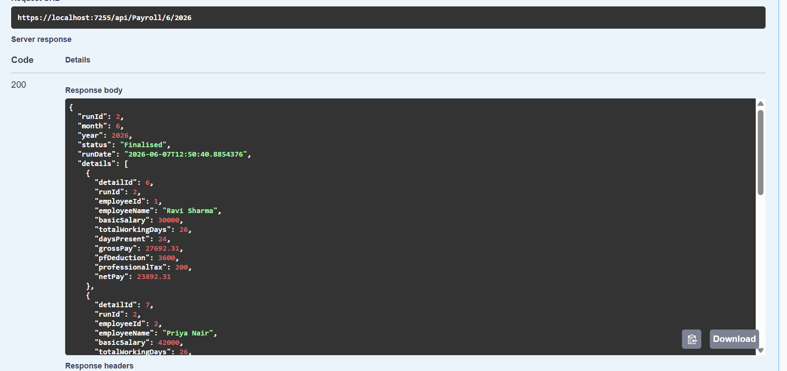

#### Payroll Slip API

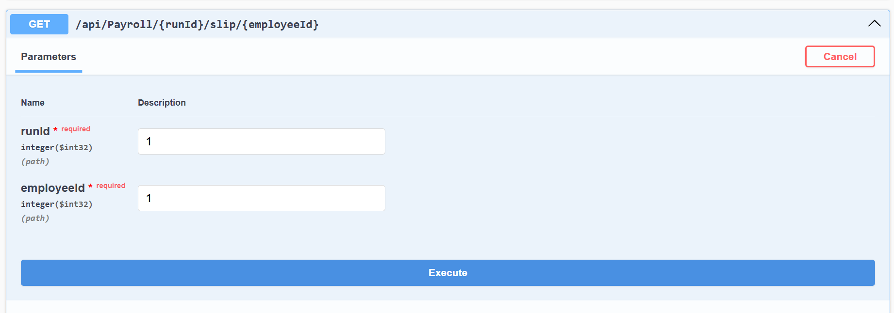
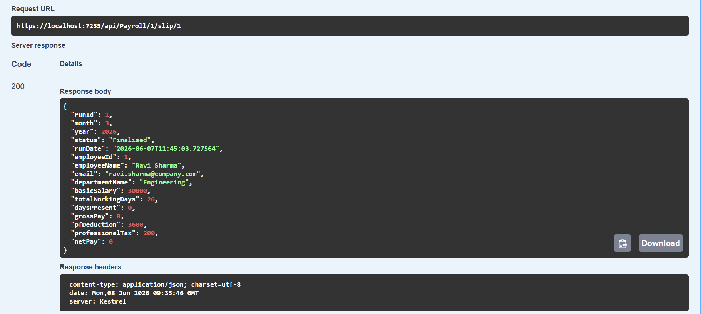

---

### User Interface

#### Payroll UI
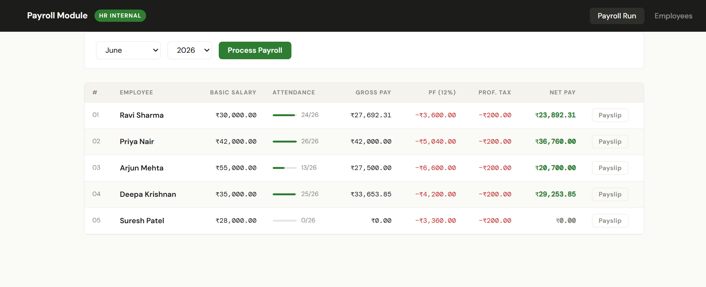

#### Employee UI
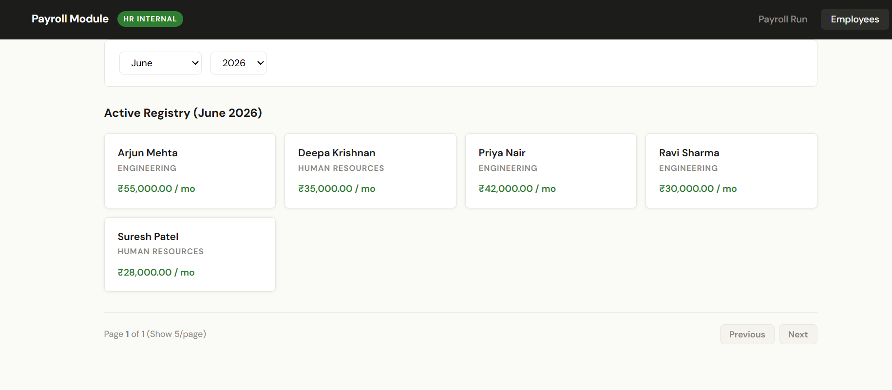

---

## Tech Stack

| Layer      | Technology                               |
|------------|------------------------------------------|
| Backend    | ASP.NET Core 10 Web API (C#)             |
| DB Access  | Dapper + ADO.NET (no ORM)                |
| Database   | SQL Server (Developer / Express edition) |
| Validation | FluentValidation                         |
| Frontend   | React 18 + Vite                          |
| API Docs   | Swagger UI                               |

---

## Project Structure

### Backend — `Payroll.api/`

```
Payroll.api/
├── Controllers/
│   ├── EmployeesController.cs        GET /api/employees?page=1&pageSize=10
│   └── PayrollController.cs          POST /api/payroll/run
│                                     GET  /api/payroll/{month}/{year}
│                                     GET  /api/payroll/{runId}/slip/{employeeId}
├── Models/
│   ├── Employee.cs
│   ├── PayrollRun.cs                 also contains PayrollDetail
│   ├── Payslip.cs
│   ├── RunPayrollRequest.cs          POST body model
│   └── PagedResult.cs                generic pagination wrapper
├── Repository/
│   ├── IPayrollRepository.cs
│   └── PayrollRepository.cs          all Dapper calls to stored procedures
├── Services/
│   ├── DbConnectionService.cs        singleton — holds connection string
│   ├── IPayrollService.cs
│   └── PayrollService.cs             business logic + exception handling
├── Validators/
│   └── RunPayrollRequestValidator.cs FluentValidation rules
├── SQL/
│   ├── 01_Schema.sql                 creates PayrollDB + all 5 tables + triggers
│   ├── 02_SeedData.sql               5 employees, 2 departments, June 2026 attendance
│   └── 03_StoredProcedures.sql       usp_RunPayroll, usp_GetPayrollRun, usp_GetPayslip
├── appsettings.json                  connection string lives here
└── Program.cs                        DI registration + middleware pipeline
```

### Frontend — `payroll-frontend/`

```
payroll-frontend/
├── src/
│   ├── api/
│   │   └── payrollApi.js             all fetch calls in one place
│   │                                 runPayroll(), fetchPayrollRun(),
│   │                                 fetchPayslip(), fetchEmployees()
│   │
│   ├── components/
│   │   ├── Header.jsx                top nav bar — Payroll Run / Employees tabs
│   │   ├── Toast.jsx                 success / error / info notification bar
│   │   ├── Spinner.jsx               loading indicator (used inside buttons)
│   │   ├── SummaryStrip.jsx          5-cell strip: period, runId, status, count, total
│   │   ├── PayrollTable.jsx          results table with Payslip button per row
│   │   ├── AttBar.jsx                attendance mini progress bar
│   │   ├── PayslipModal.jsx          individual payslip popup modal
│   │   └── EmployeeCards.jsx         employee card grid
│   │
│   ├── pages/
│   │   ├── PayrollPage.jsx           month/year picker + run controls + results table
│   │   └── EmployeesPage.jsx         employee list with Prev/Next pagination
│   │
│   ├── utils/
│   │   └── format.js                 inr() currency formatter + MONTHS name array
│   │
│   ├── App.jsx                       root component — tab state + global state
│   ├── main.jsx                      ReactDOM.createRoot entry point
│   └── index.css                     global resets + CSS custom properties
│
├── index.html                        Vite HTML shell
├── vite.config.js                    dev server config + /api proxy
└── package.json                      dependencies (react, react-dom, vite)
```

---

## Prerequisites

- [.NET 10 SDK](https://dotnet.microsoft.com/download)
- [Node.js 18+](https://nodejs.org) — for the React frontend
- SQL Server Developer or Express edition running locally
- SQL Server Management Studio (SSMS) — to run the SQL scripts

---

## 1. Database Setup

### Step 1 — Open SSMS and connect

Common server names to try:
```
localhost
.\SQLEXPRESS
.\MSSQLSERVER
```
Use **Windows Authentication**.

### Step 2 — Run the SQL scripts in order

Open each file in SSMS (**File → Open → File**) and press **F5**:

```
SQL/01_Schema.sql           Creates PayrollDB and all 5 tables + immutability triggers
SQL/02_SeedData.sql         Inserts 5 employees across 2 departments
                            with attendance records for June 2026
SQL/03_StoredProcedures.sql Creates usp_RunPayroll, usp_GetPayrollRun, usp_GetPayslip
```

### Step 3 — Verify

Run this in SSMS with `PayrollDB` selected:

```sql
SELECT * FROM dbo.Employees;
SELECT name FROM sys.procedures;
```

Expected: 5 employees, 3 stored procedures.

---

## 2. Backend Setup

### Step 1 — Update the connection string

Open `appsettings.json` and set the correct server name:

```json
{
  "ConnectionStrings": {
    "PayrollDB": "Server=localhost;Database=PayrollDB;Trusted_Connection=True;TrustServerCertificate=True;"
  }
}
```

If `localhost` does not connect, try `.\SQLEXPRESS` or `.\MSSQLSERVER`.

### Step 2 — Restore and run

```bash
dotnet restore
dotnet run
```

Or press **F5** in Visual Studio.

### Step 3 — Note your port

The console will show something like:
```
Now listening on: https://localhost:7255
```

Copy this port — you will need it in the next step.

### Step 4 — Verify with Swagger

```
https://localhost:{port}/swagger
```

All 4 endpoints are listed and can be tested directly from the browser.

---

## 3. Frontend Setup (React + Vite)

### Step 1 — Install dependencies

```bash
cd payroll-frontend
npm install
```

### Step 2 — Update the API proxy port

Open `vite.config.js` and update the target to match your API port from Step 2 above:

```js
proxy: {
  '/api': {
    target: 'https://localhost:7255',  // ← change to your actual port
    changeOrigin: true,
    secure: false,
  }
}
```

> **Why a proxy?** This tells Vite's dev server to forward every `fetch('/api/...')` call
> to your ASP.NET Core backend. This means no CORS issues during development and no
> hardcoded `localhost` URLs inside the React components.

### Step 3 — Start the dev server

```bash
npm run dev
```

Open the app at:
```
http://localhost:3000
```

### Step 4 — Build for production (optional)

```bash
npm run build
```

The compiled output goes into `payroll-frontend/dist/`. To serve it from ASP.NET Core:
1. Copy the contents of `dist/` into `Payroll.api/wwwroot/`
2. Ensure `Program.cs` has `app.UseStaticFiles()` before `app.MapControllers()`
3. Navigate to `https://localhost:{port}/index.html`

---

## 4. API Endpoints

### GET `/api/employees`

Returns paginated list of all active employees.

**Query parameters (optional):**
```
?page=1&pageSize=10
```

**Response 200 — PagedResult\<Employee\>:**
```json
{
  "data": [
    {
      "employeeId": 1,
      "departmentId": 1,
      "departmentName": "Engineering",
      "fullName": "Ravi Sharma",
      "email": "ravi.sharma@company.com",
      "basicSalary": 30000.00,
      "isActive": true
    }
  ],
  "page": 1,
  "pageSize": 10,
  "totalCount": 5,
  "totalPages": 1,
  "hasNext": false,
  "hasPrev": false
}
```

---

### POST `/api/payroll/run`

Triggers the payroll calculation for a given month and year.

**Request body:**
```json
{ "month": 6, "year": 2026 }
```

**Response 201 — PayrollRun:**
```json
{
  "runId": 1,
  "month": 6,
  "year": 2026,
  "status": "Finalised",
  "runDate": "2026-06-07T10:00:00Z",
  "details": [
    {
      "detailId": 1,
      "runId": 1,
      "employeeId": 1,
      "employeeName": "Ravi Sharma",
      "basicSalary": 30000.00,
      "totalWorkingDays": 26,
      "daysPresent": 24,
      "grossPay": 27692.31,
      "pfDeduction": 3600.00,
      "professionalTax": 200.00,
      "netPay": 23892.31
    }
  ]
}
```

**Response 409** — run already exists for that month/year:
```json
{ "message": "A payroll run already exists for 6/2026." }
```

> The React frontend handles 409 gracefully — it automatically fetches and displays
> the existing run instead of showing an error.

**Response 400** — validation error (FluentValidation):
```json
{
  "errors": {
    "Month": ["Month must be between 1 and 12."]
  }
}
```

---

### GET `/api/payroll/{month}/{year}`

Returns the saved payroll run for a given period.

**Response 200** — same shape as the POST 201 response above.

**Response 404:**
```json
{ "message": "No payroll run found for 6/2026." }
```

---

### GET `/api/payroll/{runId}/slip/{employeeId}`

Returns an individual payslip. Richer than a detail row — includes
`departmentName` and `email` from the employee record.

**Response 200 — Payslip:**
```json
{
  "runId": 1,
  "month": 6,
  "year": 2026,
  "status": "Finalised",
  "runDate": "2026-06-07T10:00:00Z",
  "employeeId": 1,
  "employeeName": "Ravi Sharma",
  "email": "ravi.sharma@company.com",
  "departmentName": "Engineering",
  "basicSalary": 30000.00,
  "totalWorkingDays": 26,
  "daysPresent": 24,
  "grossPay": 27692.31,
  "pfDeduction": 3600.00,
  "professionalTax": 200.00,
  "netPay": 23892.31
}
```

**Response 404:**
```json
{ "message": "No payslip found for employee 1 in run 1." }
```

---

## 5. Payroll Calculation Rules

| Component        | Formula                                              |
|------------------|------------------------------------------------------|
| Gross Pay        | `(BasicSalary ÷ TotalWorkingDays) × DaysPresent`     |
| PF Deduction     | `12% of BasicSalary` — not gross pay                 |
| Professional Tax | Flat ₹200 per month                                  |
| Net Pay          | `GrossPay − PFDeduction − ProfessionalTax` (min ₹0) |

**Example (from spec):**

| Employee    | Basic   | Days | Present | Gross      | PF      | PT   | Net        |
|-------------|---------|------|---------|------------|---------|------|------------|
| Ravi Sharma | ₹30,000 | 26   | 24      | ₹27,692.31 | ₹3,600  | ₹200 | ₹23,892.31 |

---

## 6. Assumptions

Decisions made where the brief did not specify exact behaviour:

**1. PF on zero-attendance employees**
PF is deducted from BasicSalary regardless of attendance. PF is a statutory deduction on salary, not on earnings. An employee on unpaid leave still has PF calculated on their basic.

**2. Net Pay floored at zero**
For an employee with 0 days present: GrossPay = ₹0, but PF + PT > ₹0. Rather than returning a negative net pay, it is clamped to ₹0. This is handled in the stored procedure using `GREATEST(calculated, 0)`.

**3. Missing attendance records**
If no attendance record exists for an employee in the selected month, they are included with `DaysPresent = 0` and `TotalWorkingDays = 26` (default). They are not silently excluded from the run.

**4. Professional Tax not prorated**
PT is a flat ₹200 regardless of how many days the employee worked that month.

**5. TotalWorkingDays stored per attendance record**
The system does not auto-calculate working days from a calendar. HR enters the figure when recording attendance. This allows flexibility for months with public holidays.

**6. Immutability enforced at two levels**
- Application level: `POST /api/payroll/run` returns 409 if a run already exists.
- Database level: `AFTER UPDATE, DELETE` triggers on `PayrollRuns` and `PayrollRunDetails` raise an error and rollback, so no direct SQL can corrupt a finalised run.

**7. Only active employees included**
Employees with `IsActive = false` are excluded from payroll runs.

**8. No Draft state**
Runs are marked `Finalised` immediately on creation. The brief did not specify a Draft → Finalise workflow, so it was kept simple.

---

## 7. Bonus Features Implemented

| Feature | Where |
|---------|-------|
| HTTP 409 Conflict on duplicate run | `PayrollService` catches the SP error, throws `PayrollAlreadyExistsException`; controller returns `Conflict()`. React `PayrollPage.jsx` auto-fetches and displays the existing run. |
| Payslip modal per employee | `GET /api/payroll/{runId}/slip/{employeeId}` + `PayslipModal.jsx` — opened by the Payslip button on each table row |
| FluentValidation | `RunPayrollRequestValidator.cs` validates month (1–12) and year (2000–2100) before reaching the service layer |
| Singleton DB connection service | `DbConnectionService` registered as `AddSingleton` — holds only the connection string, not a live connection |
| Pagination on employees | `GET /api/employees?page=1&pageSize=10` returns `PagedResult<Employee>` with `hasNext` / `hasPrev`; `EmployeesPage.jsx` renders Prev/Next controls |
| Vite API proxy | `vite.config.js` forwards all `/api` requests to the backend — eliminates CORS issues in development |

---

## 8. What I Would Add With More Time

- **Unit tests** — xUnit tests for the net pay calculation. The formula is a pure function and trivial to test in isolation. Would also cover the 409 conflict path and the zero-attendance edge case.

- **Print-friendly payslip** — a Print button inside `PayslipModal.jsx` using `window.print()` with a `@media print` CSS stylesheet that hides the rest of the UI.

- **Authentication** — the API currently has no auth. In production this would use JWT bearer tokens with role-based access (HR vs Employee vs Manager).

- **Audit log** — a table recording who triggered each payroll run, from which IP, and at what time.

- **Department filter on payroll results** — allow HR to filter the results table by department without reloading the page.

- **Attendance module** — A proper attendance workflow:
  - Employee logs in and submits a monthly timesheet.
  - Manager reviews and approves or rejects it.
  - HR sees only approved attendance records when running payroll.
  - Employees can view their own payslip but cannot trigger a payroll run — that action is restricted to the HR role only.

- **Structured logging** — currently logs to console only. In production, would use Serilog with a sink like Seq or Application Insights.

- **Environment-specific connection strings** — move the connection string to `appsettings.Development.json` and use environment variables or Azure Key Vault for production secrets.

---

## 9. Running the Smoke Test

To verify the stored procedure directly in SSMS before touching the API:

```sql
USE PayrollDB;
EXEC dbo.usp_RunPayroll @Month = 6, @Year = 2026;
```

Expected: 5 rows returned.

| Employee       | Net Pay    | Notes                      |
|----------------|------------|----------------------------|
| Ravi Sharma    | ₹23,892.31 | Matches the spec example   |
| Priya Nair     | ₹36,760.00 | Full attendance             |
| Arjun Mehta    | ₹20,700.00 | 13/26 days — half month    |
| Deepa Krishnan | ₹29,253.85 | 25/26 days                 |
| Suresh Patel   | ₹0.00      | 0 days present — edge case |